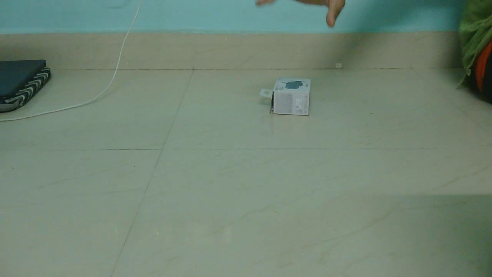
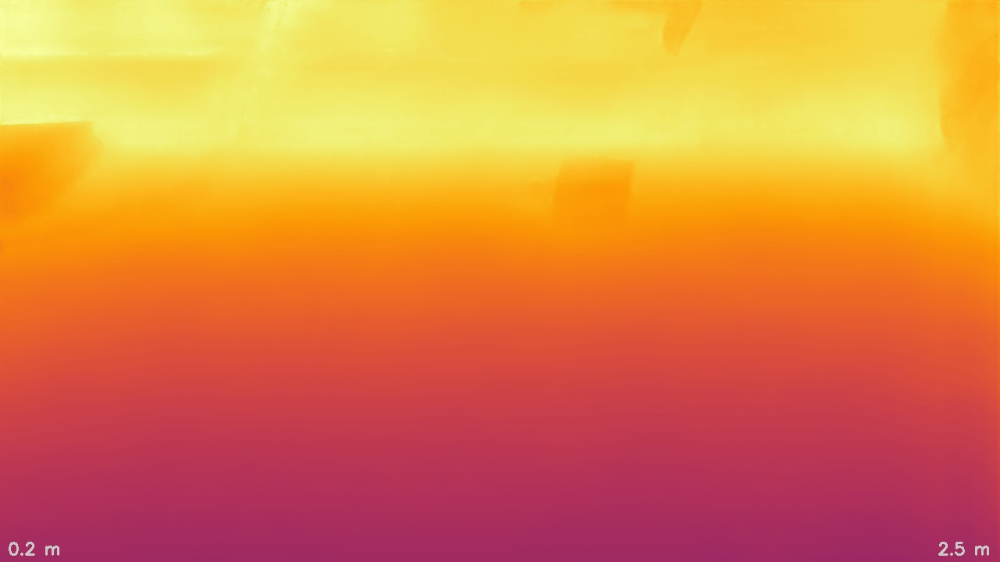
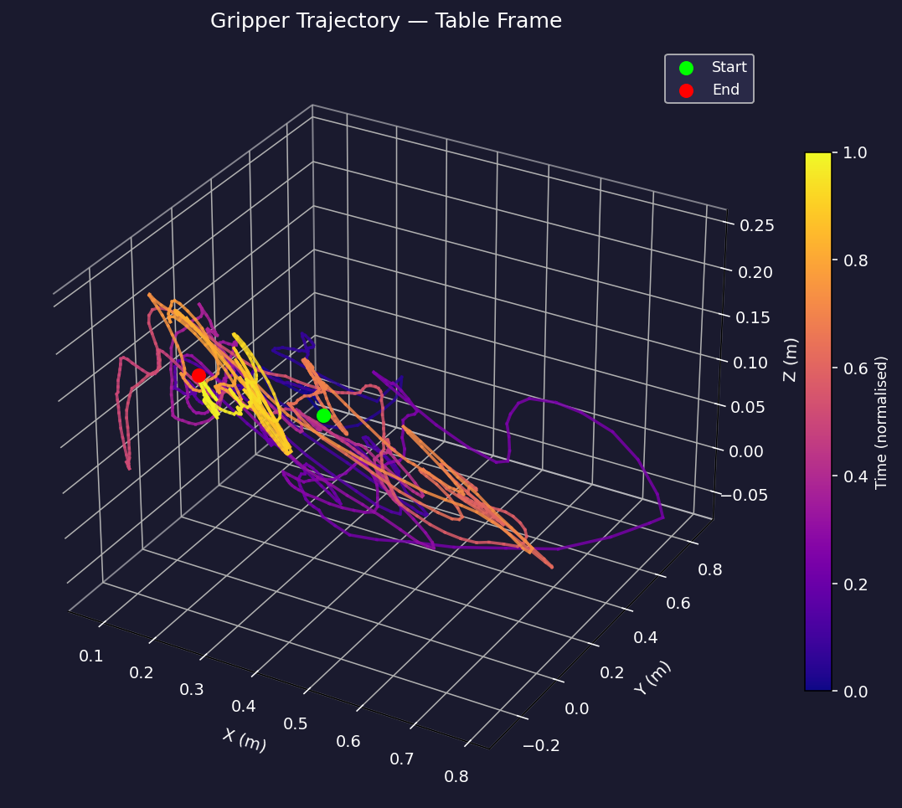
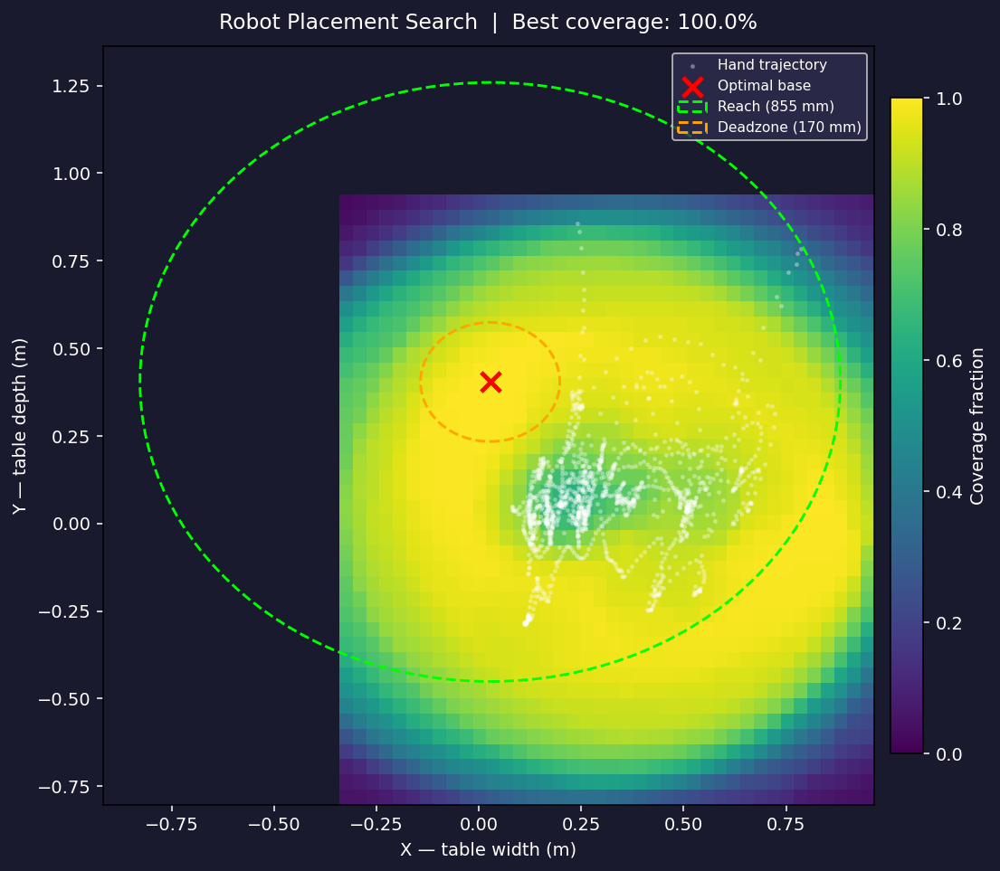
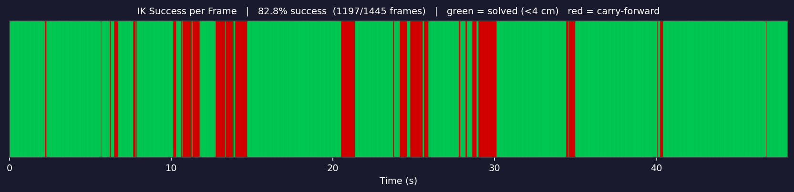
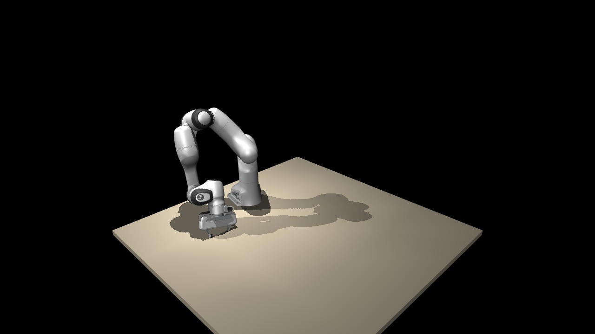
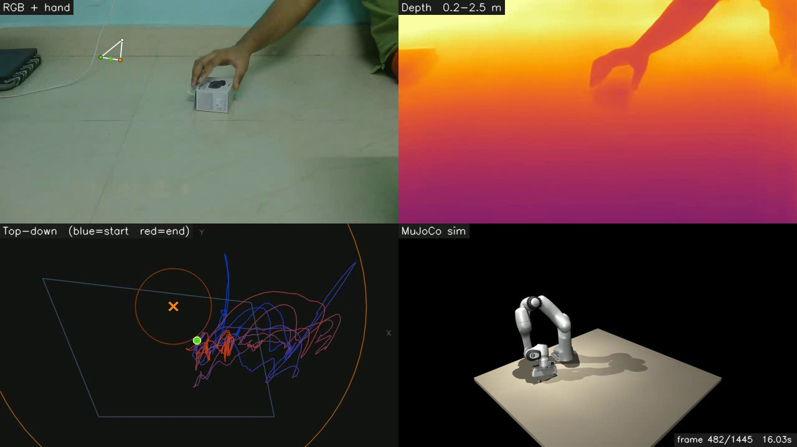

# H2R — Human to Robot

> Convert a monocular webcam video of a human hand manipulation into a Franka Panda robot trajectory — **no teleoperation hardware required**.

The output is joint-angle training data compatible with [ACT](https://arxiv.org/abs/2304.13705) and [Diffusion Policy](https://diffusion-policy.cs.columbia.edu/) as a direct substitute for teleoperated demonstrations.

**Theory & design rationale** → [THEORY.md](THEORY.md) | **Learning roadmap** → [LEARNING_ROADMAP.md](LEARNING_ROADMAP.md)

---

## Pipeline at a Glance

```
Webcam video  →  Hand tracking  →  Metric depth  →  3D trajectory
     →  Smoothing  →  IK solving  →  MuJoCo simulation  →  Training data
```

<table>
<tr>
<td align="center"><b>Raw Input</b></td>
<td align="center"><b>Hand Tracking</b></td>
<td align="center"><b>Metric Depth</b></td>
</tr>
<tr>
<td></td>
<td></td>
<td></td>
</tr>
<tr>
<td align="center"><b>3D Trajectory</b></td>
<td align="center"><b>Workspace Analysis</b></td>
<td align="center"><b>IK Success Timeline</b></td>
</tr>
<tr>
<td></td>
<td></td>
<td></td>
</tr>
</table>

### Simulation Output

<table>
<tr>
<td align="center"><b>MuJoCo Render</b></td>
<td align="center"><b>4-Panel Composite</b></td>
</tr>
<tr>
<td></td>
<td></td>
</tr>
</table>

### Full Pipeline Demo (GIF)


---

## Results

| Metric | Value |
|---|---|
| IK success rate | **91.6%** (305 / 333 frames) |
| Success threshold | 4 cm position error |
| Remaining failures | 8.4% — genuine workspace-boundary positions |
| Depth temporal noise | 30–130 mm std dev per fixed point |
| Processing time (per demo) | ~2–3 min on mid-tier GPU |
| Output format | `joint_angles (N×7)` + `gripper (N)` — drop-in for ACT / Diffusion Policy |

---

## Architecture

```
H2R/
├── pipeline.py                  ← main CLI entrypoint
├── src/
│   ├── config.py                ← all constants and paths
│   ├── calibration/
│   │   ├── surface.py           ← SVD plane fitting, T_cam→table transform
│   │   └── ui.py                ← interactive 4-corner calibration
│   ├── tracking/
│   │   ├── depth_model.py       ← Depth Anything V2 metric wrapper
│   │   ├── hand_tracker.py      ← MediaPipe Hands wrapper
│   │   ├── trajectory.py        ← per-frame 3D extraction
│   │   └── smoother.py          ← Savitzky-Golay smoothing
│   ├── ik/
│   │   ├── solver.py            ← single-frame DLS IK
│   │   ├── trajectory_solver.py ← warmstarted IK + velocity clamping
│   │   └── workspace.py         ← placement grid search
│   └── render/
│       ├── mujoco_renderer.py   ← headless MuJoCo rendering
│       ├── composite.py         ← 4-panel frame assembly
│       └── writer.py            ← video export
├── scripts/                     ← one script per pipeline phase
├── robot/
│   └── panda.xml                ← Franka Panda MuJoCo model + table
└── media/                       ← demo assets (this README)
```

---

## Prerequisites & Installation

### Hardware

- **GPU** — CUDA-capable (required for Depth Anything V2)
- **Camera** — any webcam; Logitech Brio 100 has pre-computed intrinsics
- **OS** — Windows 10/11 (tested), Linux works with minor path adjustments

### Install

```bash
# 1. Clone
git clone https://github.com/Janeshvar/H2R.git
cd H2R

# 2. Python dependencies
pip install torch torchvision --index-url https://download.pytorch.org/whl/cu118
pip install mujoco mediapipe opencv-python numpy scipy matplotlib imageio

# 3. Clone Depth-Anything-V2 (read-only dependency)
git clone https://github.com/DepthAnything/Depth-Anything-V2 Depth-Anything-V2
pip install -r Depth-Anything-V2/requirements.txt

# 4. Download metric depth checkpoint (~100 MB)
python scripts/download_metric_checkpoint.py
```

The checkpoint is saved to `checkpoints/depth_anything_v2_metric_hypersim_vits.pth`.

---

## Quick Start

```bash
# Calibrate the table surface and record a demo
python pipeline.py record

# Process video: extract trajectory + smooth + find robot placement
python pipeline.py process data/take1.mp4

# Solve IK + render simulation + generate composite video
python pipeline.py simulate data/take1.mp4

# Or run the full pipeline in one command
python pipeline.py run data/take1.mp4
```

### Options

```bash
# Different simulation camera angle
python pipeline.py simulate data/take1.mp4 --camera top

# Skip composite video (faster)
python pipeline.py simulate data/take1.mp4 --skip-composite

# Custom output directory
python pipeline.py run data/take1.mp4 --output-dir my_outputs/
```

---

## Pipeline Reference

### `pipeline.py process <video>`

| Script | What it does | Output |
|---|---|---|
| `scripts/extract_trajectory.py` | MediaPipe + DAV2 per frame → 3D table-frame trajectory | `data/<stem>_raw.npz` |
| `scripts/smooth_trajectory.py` | Savitzky-Golay filter (window=15, poly=3) | `data/<stem>_smoothed.npz` |
| `scripts/analyze_workspace.py` | 40×40 grid search → optimal robot base placement | `data/<stem>_placement.json` |

### `pipeline.py simulate <video>`

| Script | What it does | Output |
|---|---|---|
| `scripts/solve_ik.py` | Warmstarted DLS IK, joint velocity clamping | `data/<stem>_joints.npz` |
| `scripts/render_sim.py` | Headless MuJoCo render | `outputs/<stem>_<camera>.mp4` |
| `scripts/render_composite.py` | 4-panel composite video | `outputs/<stem>_composite.mp4` |

### Standalone diagnostics

```bash
# Render a single frame to PNG (fast smoke test)
python scripts/render_sim.py --joints data/take1_joints.npz --smoke-test

# Plot 3D trajectory
python scripts/plot_trajectory.py --smoothed data/take1_smoothed.npz

# Validate depth model accuracy
python scripts/validate_depth.py

# Re-export README demo assets
python scripts/export_demo_assets.py
```

---

## How It Works

### Step 1 — Table calibration

The user touches each of the four corners of the recording surface with their index fingertip. For each corner, 10 frames are captured and the **median depth** from a 5×5 patch is used to reduce silhouette noise. SVD plane fitting recovers the table plane, and the four corners define a rigid transform `T_cam→table` saved to `data/calibration.json`.

### Step 2 — Hand tracking + depth

For each video frame:
1. **MediaPipe Hands** detects 21 2D landmarks at sub-pixel accuracy
2. **Depth Anything V2** (Hypersim indoor metric checkpoint) estimates metric depth in metres
3. A 5×5 median patch is sampled around each landmark to avoid fingertip silhouette depth errors
4. Pinhole back-projection lifts each landmark to a 3D point in camera frame
5. `T_cam→table` transforms all points to table frame

```
X = (px - cx) * depth / fx
Y = (py - cy) * depth / fy
Z = depth
```

### Step 3 — Smoothing

Depth Anything V2 processes each frame independently with no temporal memory. This produces 30–130 mm of temporal noise at a fixed point. **Savitzky-Golay filtering** (window=15 frames, polynomial order=3) is applied offline — it uses future frames, so it has zero lag, unlike EMA. Detection gaps are linearly interpolated before filtering.

### Step 4 — Robot placement

A 40×40 grid of candidate robot base positions is evaluated over the table XY plane. Each candidate is scored as the fraction of trajectory waypoints inside the Panda's reachable annulus (inner dead zone 0.170 m, outer reach 0.855 m). The best position typically achieves >95% geometric coverage.

### Step 5 — Inverse kinematics

**Damped Least-Squares (DLS) IK:**
```
Δq = Jᵀ(JJᵀ + λI)⁻¹ · e
```
Where `λ = 1e-4` (damping), `J` is the 6×7 Jacobian, and `e` is the 6D task error (position + orientation).

Three design decisions are critical:
1. **Warmstart** — each frame initialises from the previous frame's solution (mandatory for trajectory continuity)
2. **Velocity clamping** — joint change is scaled to respect the 2.175 rad/s hardware limit
3. **50 iterations is optimal** — more iterations paradoxically reduce success rate by producing solutions further from the warmstart, causing a velocity-clamping cascade

Current success rate: **91.6%** at the 4 cm threshold. The remaining 8.4% are genuine workspace-boundary positions.

### Step 6 — Simulation and composite

Joint angles and gripper state are replayed in a headless **MuJoCo** simulation. The 4-panel composite video combines:
- Top-left: original RGB with hand skeleton back-projected from 3D
- Top-right: metric depth (inferno colormap, 0.2–2.5 m)
- Bottom-left: top-down table view with trajectory and robot placement
- Bottom-right: MuJoCo simulation

---

## Configuration

All constants live in `src/config.py`. Key values with rationale:

| Constant | Value | Notes |
|---|---|---|
| `IK_GAIN` | 0.3 | Lower gain reduces velocity-clamping cascade. Do not increase to 0.5+ |
| `IK_DAMPING` | 1e-4 | Prevents large updates near singularities |
| `IK_ITERATIONS` | 50 | Optimal — more iterations hurt by degrading the warmstart for the next frame |
| `PANDA_REACH_M` | 0.855 | Outer reachability sphere (metres) |
| `PANDA_DEADZONE_M` | 0.170 | Inner dead zone — too close to reach |
| `PANDA_MAX_JOINT_VEL` | 2.175 | Hardware joint velocity limit (rad/s) |

Success threshold (4 cm) is at `src/ik/solver.py:135` — not in config.

---

## Output Format

```
data/<stem>_joints.npz
  joint_angles  (N, 7)   float32   joint angles in radians
  gripper       (N,)     float32   gripper opening in metres [0, 0.08]
  ik_success    (N,)     bool      True if final position error < 4 cm
  fps           scalar   float     frames per second of original video
  n_frames      scalar   int       total number of frames
```

This is the direct input format for ACT and Diffusion Policy training.

---

## Recreating the Demo Assets

After running the full pipeline on `data/take1.mp4`:

```bash
python scripts/export_demo_assets.py
```

This generates all images and the GIF in `media/`. The GIF requires `imageio`:

```bash
pip install imageio[ffmpeg]
```

---

## Known Limitations

1. **Workspace boundary failures** — 8.4% of frames are unreachable. Carry-forward keeps the trajectory continuous but the robot appears frozen in these segments.

2. **Orientation approximation** — wrist roll is not recovered from MediaPipe. The end-effector orientation is derived from the palm normal and grasp axis only. Tasks requiring wrist rotation (unscrewing, turning) are not well-supported.

3. **No object tracking** — the pipeline captures arm motion only. Object state is not included. Policy training requires an object to be placed in simulation at an approximate known position.

4. **Monocular depth noise** — 30–130 mm temporal std dev. Savitzky-Golay mitigates but does not eliminate it. An RGB-D camera (Intel RealSense D435) would reduce this to 2–5 mm.

5. **Single hand only** — bimanual tasks are out of scope.

---

## Troubleshooting

**`ValueError: Image width N > framebuffer width 640`**
`robot/panda.xml` must contain `<global offwidth="1920" offheight="1080"/>` inside `<visual>`.

**`ModuleNotFoundError: No module named 'mediapipe'`**
Only needed for calibration, recording, and extraction. IK and rendering work without it.

**`ModuleNotFoundError: No module named 'depth_anything_v2'`**
The `Depth-Anything-V2/` directory is missing. Re-clone it (see Installation).

**IK success rate is 0%**
`IK_GAIN` in `src/config.py` may be 2.0 (diverges). Set `IK_GAIN = 0.3`.

**Simulation appears frozen for several seconds**
Expected — this is the carry-forward region where IK failed at workspace boundaries.

**Camera not found during recording**
Try `python pipeline.py record --camera-index 1`.

---

## Roadmap

Next planned improvements (see expert panel discussion in [LESSONS_FOR_CLAUDE.md](LESSONS_FOR_CLAUDE.md)):

- [ ] Output end-effector poses (xyz + quaternion) alongside joint angles
- [ ] Grasp-close event detection for task segmentation
- [ ] Filter trajectory segments by IK success rate
- [ ] Recover wrist roll from MediaPipe landmarks
- [ ] Add configurable object to simulation scene
- [ ] RGB-D camera support (Intel RealSense D435)
- [ ] SAM2-based object tracking for 3D position
- [ ] Benchmark against teleoperated demonstrations (ACT training)

---

## Citation

If you use this project in your research:

```bibtex
@misc{h2r2026,
  title  = {H2R: Human to Robot — Teleoperation-Free Manipulation Data Collection},
  author = {Janeshvar},
  year   = {2026},
  url    = {https://github.com/Janeshvar/H2R}
}
```
