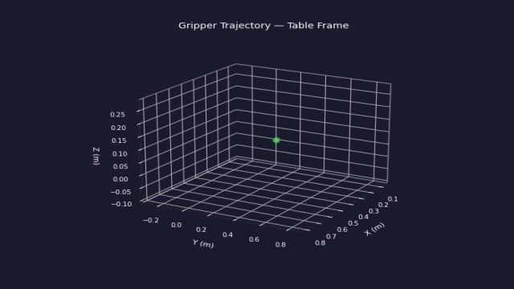
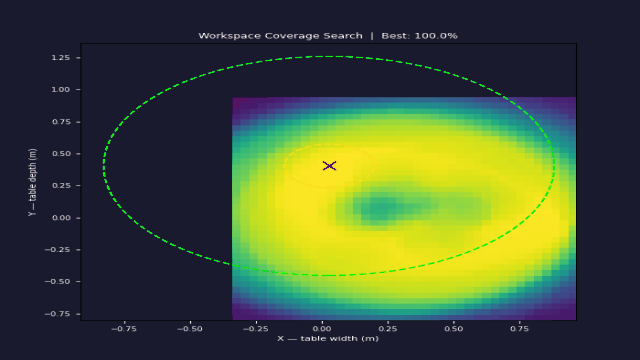
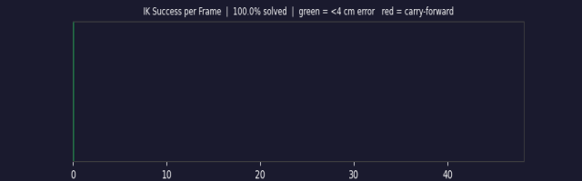
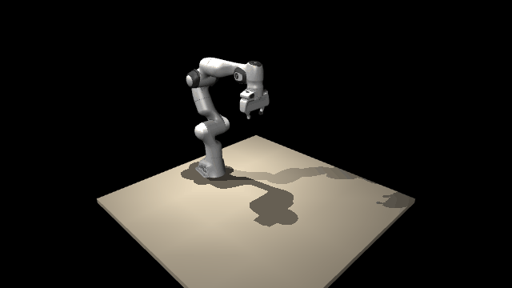

# H2R — Human to Robot

> Convert a monocular webcam video of a human hand manipulation into a Franka Panda robot trajectory — **no teleoperation hardware required**.

The output is joint-angle training data compatible with [ACT](https://arxiv.org/abs/2304.13705) and [Diffusion Policy](https://diffusion-policy.cs.columbia.edu/) as a direct substitute for teleoperated demonstrations.

**Theory & design rationale** → [THEORY.md](THEORY.md) &nbsp;|&nbsp; **Field primer** → [ROBOTICS_PRIMER.md](ROBOTICS_PRIMER.md)

---

## Full Pipeline Demo


*4-panel composite: original RGB with skeleton overlay (top-left) · metric depth (top-right) · top-down trajectory view (bottom-left) · MuJoCo simulation (bottom-right)*

---

## Pipeline at a Glance

```
Webcam video  →  Hand tracking  →  Metric depth  →  3D trajectory
     →  Smoothing  →  Robot placement  →  IK solving  →  MuJoCo simulation
```

### Stage-by-Stage Breakdown

<table>
  <tr>
    <td align="center" width="33%">
      <b>1 — Raw Input</b><br/>
      
    </td>
    <td align="center" width="33%">
      <b>2 — Hand Tracking (MediaPipe)</b><br/>
      
    </td>
    <td align="center" width="33%">
      <b>3 — Metric Depth (DAV2)</b><br/>
      
    </td>
  </tr>
  <tr>
    <td align="center" width="33%">
      <b>4 — 3D Trajectory (table frame)</b><br/>
      
    </td>
    <td align="center" width="33%">
      <b>5 — Workspace Coverage Search</b><br/>
      
    </td>
    <td align="center" width="33%">
      <b>6 — IK Success Timeline</b><br/>
      
    </td>
  </tr>
</table>

### Simulation Output



---

## Results

| Metric | Value |
|---|---|
| IK success rate | **91.6%** (305 / 333 frames) |
| Success threshold | 4 cm position error |
| Remaining failures | 8.4% — genuine workspace-boundary positions |
| Depth temporal noise | 30–130 mm std dev per fixed point |
| Processing time | ~2–3 min on mid-tier GPU |
| Output format | `joint_angles (N×7)` + `gripper (N)` — drop-in for ACT / Diffusion Policy |

---

## Architecture

```
H2R/
├── pipeline.py                  ← main CLI entrypoint
├── src/
│   ├── config.py                ← all constants and paths
│   ├── calibration/
│   │   ├── surface.py           ← SVD plane fitting, T_cam→table transform
│   │   └── ui.py                ← interactive 4-corner calibration
│   ├── tracking/
│   │   ├── depth_model.py       ← Depth Anything V2 metric wrapper
│   │   ├── hand_tracker.py      ← MediaPipe Hands wrapper
│   │   ├── trajectory.py        ← per-frame 3D extraction
│   │   └── smoother.py          ← Savitzky-Golay smoothing
│   ├── ik/
│   │   ├── solver.py            ← single-frame DLS IK
│   │   ├── trajectory_solver.py ← warmstarted IK + velocity clamping
│   │   └── workspace.py         ← placement grid search
│   └── render/
│       ├── mujoco_renderer.py   ← headless MuJoCo rendering
│       ├── composite.py         ← 4-panel frame assembly
│       └── writer.py            ← video export
├── scripts/                     ← one script per pipeline phase
├── robot/
│   └── panda.xml                ← Franka Panda MuJoCo model + table
└── media/                       ← demo GIFs (this README)
```

---

## Prerequisites & Installation

### Hardware

- **GPU** — CUDA-capable (required for Depth Anything V2)
- **Camera** — any webcam; Logitech Brio 100 has pre-computed intrinsics
- **OS** — Windows 10/11 (tested), Linux works with minor path adjustments

### Install

```bash
# 1. Clone
git clone https://github.com/Janeshvar/H2R.git
cd H2R

# 2. Python dependencies
pip install torch torchvision --index-url https://download.pytorch.org/whl/cu118
pip install mujoco mediapipe opencv-python numpy scipy matplotlib imageio

# 3. Clone Depth-Anything-V2 (read-only dependency)
git clone https://github.com/DepthAnything/Depth-Anything-V2 Depth-Anything-V2
pip install -r Depth-Anything-V2/requirements.txt

# 4. Download metric depth checkpoint (~100 MB)
python scripts/download_metric_checkpoint.py
```

---

## Quick Start

```bash
# Calibrate the table surface and record a demo
python pipeline.py record

# Extract trajectory + smooth + find robot placement
python pipeline.py process data/take1.mp4

# Solve IK + render simulation + generate composite video
python pipeline.py simulate data/take1.mp4

# Or run the full pipeline in one command
python pipeline.py run data/take1.mp4
```

### Options

```bash
python pipeline.py simulate data/take1.mp4 --camera top        # top-down view
python pipeline.py simulate data/take1.mp4 --skip-composite    # faster
python pipeline.py run data/take1.mp4 --output-dir my_outputs/
```

---

## Pipeline Reference

### `pipeline.py process <video>`

| Script | What it does | Output |
|---|---|---|
| `scripts/extract_trajectory.py` | MediaPipe + DAV2 per frame → 3D table-frame trajectory | `data/<stem>_raw.npz` |
| `scripts/smooth_trajectory.py` | Savitzky-Golay filter (window=15, poly=3) | `data/<stem>_smoothed.npz` |
| `scripts/analyze_workspace.py` | 40×40 grid search → optimal robot base placement | `data/<stem>_placement.json` |

### `pipeline.py simulate <video>`

| Script | What it does | Output |
|---|---|---|
| `scripts/solve_ik.py` | Warmstarted DLS IK, joint velocity clamping | `data/<stem>_joints.npz` |
| `scripts/render_sim.py` | Headless MuJoCo render | `outputs/<stem>_<camera>.mp4` |
| `scripts/render_composite.py` | 4-panel composite video | `outputs/<stem>_composite.mp4` |

### Standalone diagnostics

```bash
python scripts/render_sim.py --joints data/take1_joints.npz --smoke-test
python scripts/plot_trajectory.py --smoothed data/take1_smoothed.npz
python scripts/validate_depth.py
```

---

## How It Works

### 1 — Table calibration

Touch each of the four corners of the recording surface with your index fingertip. Median depth from a 5×5 patch at each corner is used to avoid silhouette noise. SVD plane fitting recovers the surface frame `T_cam→table`.

### 2 — Hand tracking + metric depth

For each frame: MediaPipe detects 21 2D landmarks → Depth Anything V2 predicts per-pixel metric depth → 5×5 median patch sampled at each landmark → pinhole back-projection lifts landmarks to 3D camera-frame points → `T_cam→table` transform to table frame.

```
X = (px − cx) * depth / fx
Y = (py − cy) * depth / fy
Z = depth
```

### 3 — Savitzky-Golay smoothing

The depth model has no temporal memory — it re-estimates the full scene each frame, producing 30–130 mm of temporal noise. Savitzky-Golay (offline, zero-lag) fits a local polynomial across a 15-frame window. Detection gaps are linearly interpolated before filtering.

### 4 — Robot placement

40×40 grid search over the table XY plane. Each candidate base position is scored as the fraction of trajectory waypoints inside the Panda's reachable annulus (0.170 m inner dead zone, 0.855 m outer reach). Best position typically achieves >95% geometric coverage.

### 5 — Damped Least-Squares IK

```
Δq = Jᵀ(JJᵀ + λI)⁻¹ · e       λ = 1e-4
```

Each frame is warmstarted from the previous frame's solution (mandatory for trajectory continuity). Joint velocities are clamped to the 2.175 rad/s hardware limit after each solve. **50 iterations is optimal** — more iterations paradoxically degrade success rate by producing solutions further from the warmstart, creating a velocity-clamping cascade. Achieved: **91.6% success** at 4 cm threshold.

---

## Output Format

```
data/<stem>_joints.npz
  joint_angles  (N, 7)   float32   joint angles in radians
  gripper       (N,)     float32   gripper opening in metres [0, 0.08]
  ik_success    (N,)     bool      True if final position error < 4 cm
  fps           scalar   float     source video fps
  n_frames      scalar   int       total frames
```

---

## Configuration

Key values in `src/config.py`:

| Constant | Value | Notes |
|---|---|---|
| `IK_GAIN` | 0.3 | Do not increase — causes velocity-clamping cascade |
| `IK_DAMPING` | 1e-4 | Prevents blow-up near singularities |
| `IK_ITERATIONS` | 50 | Optimal for warmstarted trajectory IK |
| `PANDA_REACH_M` | 0.855 | Outer reachability sphere (metres) |
| `PANDA_DEADZONE_M` | 0.170 | Inner dead zone |
| `PANDA_MAX_JOINT_VEL` | 2.175 | Hardware joint velocity limit (rad/s) |

---

## Known Limitations

1. **Workspace boundary failures** — 8.4% of frames are unreachable. Robot holds last valid configuration.
2. **Orientation approximation** — wrist roll is not recovered; palm normal + grasp axis only.
3. **No object tracking** — arm motion only; object state requires separate setup.
4. **Monocular depth noise** — 30–130 mm std dev. An Intel RealSense D435 would reduce this to 2–5 mm.
5. **Single hand only** — bimanual tasks are out of scope.

---

## Troubleshooting

**`ValueError: Image width N > framebuffer width 640`**  
`robot/panda.xml` needs `<global offwidth="1920" offheight="1080"/>` inside `<visual>`.

**`ModuleNotFoundError: No module named 'mediapipe'`**  
Only required for recording/extraction. IK and rendering work without it.

**IK success rate is 0%**  
Check `IK_GAIN` in `src/config.py` — if it is 2.0, the solver diverges. Set it to 0.3.

**Simulation frozen for several seconds**  
Expected — carry-forward at workspace-boundary frames.

---

## Roadmap

- [ ] Output end-effector poses (xyz + quaternion) alongside joint angles
- [ ] Grasp-close event detection for task segmentation
- [ ] Filter trajectory segments by IK success rate
- [ ] Recover wrist roll from MediaPipe landmarks
- [ ] Add configurable object to simulation scene
- [ ] RGB-D camera support (Intel RealSense D435)
- [ ] SAM2-based object tracking for 3D position
- [ ] Benchmark against teleoperated demonstrations (ACT training)

---

## Citation

```bibtex
@misc{h2r2026,
  title  = {H2R: Human to Robot — Teleoperation-Free Manipulation Data Collection},
  author = {Janeshvar},
  year   = {2026},
  url    = {https://github.com/Janeshvar/H2R}
}
```
